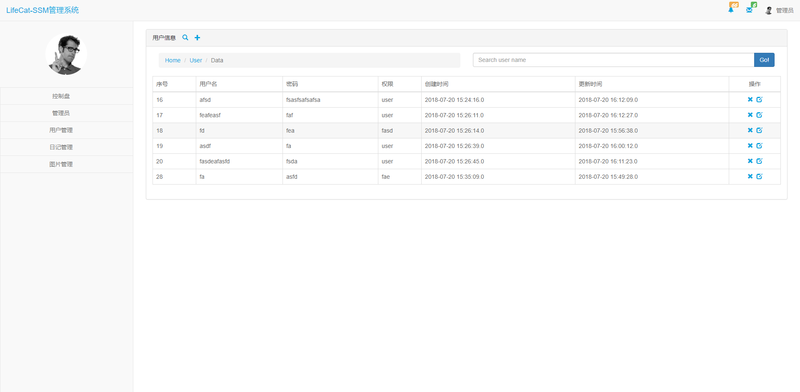
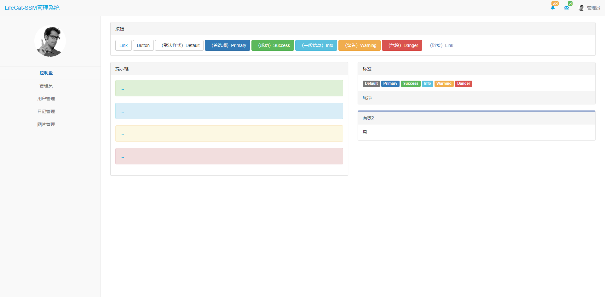

# Lifecat SSM

> 基于REST前后端分离架构. 使用SSM框架实现CRUD管理系统.   

## 技术栈

前端：jquery，ajax，layor

后端：spring，springmvc，mybatis，mail

## 使用
``` bash
# clone
git clone https://github.com/kevinten10/Lifecat-SSM

# 配置
进入 /resources
1. jdbc.properties(必须)   :修改为自己的数据库配置
2. mail.properties(非必须) :需要先去163开启邮箱服务，才可发送邮件  
    
# 数据库
运行 /doc/sql 文件，生成数据表

# 配置tomcat
(使用idea)配置tomcat的Artifact时, Application context(即项目名)需要设为"/ssm"

# 启动运行
```

## 展示

 
 
 
 
 
  

  
